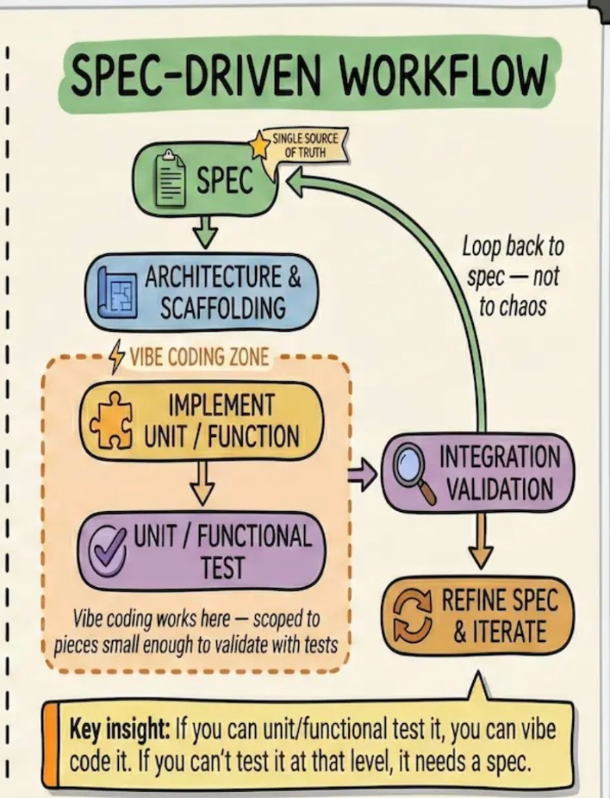

# SevensManager — Implementation specification

**Status:** Draft v2  
**Last updated:** 2026-04-02 (schema v6: competitions / teams / admin; clock notes under Phase 1)  
**Upstream:** All product intent, MVP scope, exclusions, and **resolved defaults** live in **[`PRODUCT_SPEC.md`](./PRODUCT_SPEC.md)**. If this file disagrees with that file, **`PRODUCT_SPEC.md` wins.**

This document is the **build guide**: recommended stack, architecture shape, data conventions, **phased work**, and **MVP acceptance traceability** so implementation stays aligned and incremental.

---

## 1. Purpose

- Turn [`PRODUCT_SPEC.md`](./PRODUCT_SPEC.md) into **concrete milestones** with exit criteria.
- Lock **technical guardrails** (local-first, IDs, offline) early so Firebase later does not require a rewrite.
- Leave room to swap UI libraries; **do not** treat stack details as immutable unless marked **Decision**.

---

## 2. Stack (recommended defaults)

| Layer | Recommendation | Notes |
|-------|----------------|--------|
| **Runtime** | TypeScript | Safer refactors as event types grow. |
| **App** | **Vite** + **React** | Fast dev, PWA plugins, large ecosystem. |
| **PWA** | `vite-plugin-pwa` (Workbox) | Service worker + manifest; test install on Android Chrome. |
| **UI** | **Light touch** — e.g. **MUI** or **Joy** (Material), or mostly custom CSS | Product goal is **speed and weight**, not enterprise density. |
| **Client storage** | **IndexedDB** via **Dexie.js** or **idb-keyval** + structured stores | Matches + rosters + events can outgrow `localStorage`. |
| **State** | React context + hooks, or **Zustand** if global match session gets heavy | Avoid over-engineering until live match screen proves need. |
| **Routing** | React Router (or TanStack Router) | Match list ↔ active match ↔ settings. |
| **Later: sync** | **Firebase** (Firestore + Auth as needed) | Not v1; schema IDs should be **client-generated UUIDs** from day one. |

**Decisions (can revise with reason):**

- **Decision:** **PWA first**, no App Store for v1.
- **Decision:** **UUIDs** for match/player/event IDs in the client.
- **Decision:** **Local-first persistence** before any network feature.

---

## 3. High-level architecture

```
┌─────────────────────────────────────────────────────────┐
│                     UI (React)                          │
│  Match list · Active match · Roster · Zone/action flow  │
└───────────────────────────┬─────────────────────────────┘
                            │
┌───────────────────────────▼─────────────────────────────┐
│              Domain layer (pure TS)                      │
│  Event types · ZoneId Z1-Z6 · clock helpers · validation  │
└───────────────────────────┬─────────────────────────────┘
                            │
┌───────────────────────────▼─────────────────────────────┐
│           Persistence adapter (IndexedDB)                │
│  Repos: matches, players, events · migrations v1, v2…   │
└───────────────────────────┬─────────────────────────────┘
                            │
                   (future: Sync queue → Firebase)
```

- **Domain layer** stays **framework-agnostic** so tests and future sync stay cheap.
- **Repositories** own migrations; version the on-device schema from the start (`schemaVersion` in meta store).

---

## 4. Data model (v1)

Aligned with [`PRODUCT_SPEC.md`](./PRODUCT_SPEC.md) §§3.1, 5.2, 7, 15.1.

| Entity | Key fields (conceptual) |
|--------|-------------------------|
| **Match** | `id`, `createdAt`, `title`, `opponentName` (optional), `kickoffDate` (optional), `competition` (optional), `sortKey`, `status` |
| **MatchSession** | `matchId`, `period` (segment 1…n), `clockRunning`, per-period `elapsedMs`, cumulative time before current segment, optional match/period **countdown** lengths and display modes, film clock, halftime — see `MatchSessionRecord` in code |
| **Squad / roster** | **One** managed squad per match: **12 players** (7+5), each with `onField` or slot index |
| **Player** | `id`, `matchId`, `name`, `number`, `onField` boolean or bench slot |
| **Substitution** | `id`, `matchId`, `matchTimeMs`, `playerOffId`, `playerOnId` |
| **Event** (union) | `id`, `matchId`, `type` (`try` \| `tackle` \| `pass` \| `ruck` \| …), `matchTimeMs`, `period`, `payload` |

**Payload examples (v1):**

- **Try:** `playerId`, `zoneId` (`Z1`–`Z6`)
- **Tackle:** `playerId` (tackler), `outcome`: `made` \| `missed`
- **Pass:** counter and/or `fromZone`, `toZone`, `passerId`, `receiverId` as implemented
- **Ruck:** optional `precedingPassEventId`; ruck valid without link

**Conventions**

- Store **`matchTimeMs`** (and **period**) on every event for analytics and sorting.
- **Zones** — `ZoneId` = `Z1` … `Z6` per product §5.2; never raw pixels.
- **Undo / edit** — **soft-delete** preferred: `deletedAt` on events so audit and analytics can exclude; alternatively **undo stack** for last *n* actions — pick one in Phase 3 and document in code.

---

## 5. Non-functional requirements

| Requirement | Implementation hint |
|-------------|---------------------|
| **Offline** | No hard dependency on network in v1; SW caches app shell + assets. |
| **Performance** | Target sub-100ms tap-to-feedback on mid-range Android; defer heavy work off the hot path. |
| **Resilience** | Autosave session state; recover active match after refresh/crash. |
| **Privacy** | Default: data stays on device until user opts into future sync. |

---

## 6. Phased delivery (order of work)

Each phase has **deliverables** and **exit criteria**. Validate against **§7** below. Stop and field-test when it makes sense.

### Phase 0 — Repository skeleton

**Deliverables**

- Vite + React + TS repo, lint/format baseline, PWA manifest + SW stub.
- Folder layout: `domain/`, `repos/`, `ui/`, `features/match`, etc. (adjust to taste).
- IndexedDB open + `schemaVersion` + empty migrations.

**Exit criteria**

- App installs as PWA on Android; reload works offline for shell.

---

### Phase 1 — Match container + clock

**Deliverables**

- Create / list / open / archive or delete **matches** with metadata per product §6.
- **Match session:** two **periods**, **elapsed** per period, run/pause/adjust.
- Persist session so refresh does not lose state.

**Exit criteria**

- Coach can run a “dry” match with only clock + period, no events.

**Status (implementation — retain; do not strip)**

The live clock has grown beyond the original “two periods” sketch; **keep** these behaviors when refactoring UI or persistence:

- **Session model:** `period` 1–`SESSION_PERIOD_MAX` (99), `cumulativeMsBeforeCurrentPeriod`, **match** and **period** display modes (count up / count down with lengths), **halftime** (pauses match + film clock; optional advance period), **film/game clock** fields, player minutes ledger.
- **UI:** RefLog-style **Match | play | period** strip; **−5s / +5s**, **Next**, **HT**, **✎** settings; settings dialog for period, timers, **reset match clock**; banked-time validation for match total with clear copy.
- **Domain:** `matchClock.ts` helpers (`currentMatchDisplayForUi`, `setMatchTotalFromDisplayedValue`, `resetMatchClockSession`, etc.), `normalizeSession` migrations for older rows.

Further **UI polish** for the clock is allowed; **do not remove** the above capabilities unless explicitly superseded in product spec.

---

### Phase 2 — Rosters + substitutions

**Deliverables**

- **Single 12-player squad** per match (7+5) — **own team only** (product §3.1).
- Substitution flow → **substitution records** + updated on-field state for tagging.

**Exit criteria**

- Full roster UX works offline; subs reflected in “who is on” for tagging.

---

### Phase 3 — Event log (minimal taxonomy)

**Deliverables**

- Event list with **undo** or soft-delete / edit per §4 conventions.
- Event types: **try**, **tackle** (`made` \| `missed`), **pass**, **ruck** with optional `precedingPassEventId`.
- All events stamped with **match time** + **period**.

**Exit criteria**

- Can log a full half without crashes; events appear in order with correct times.

**Status (implementation)**

- **Soft-delete:** Removing an event from the timeline sets `deletedAt` (IndexedDB row retained). `listMatchEvents` hides deleted rows. `restoreMatchEvent` exists in the repo for future undo UI.
- **Tackle:** Live rows use **M** / **X** for made / missed; stored as `tackleOutcome`. Timeline + Stats reflect the split.
- **Ruck:** `ruck` kind + optional `precedingPassEventId` on the record; UI logs a ruck from the set-piece bar (linking to a prior pass is not wired in the UI yet).
- **Analytics:** Stats tab shows totals including rucks and tackle made/missed.

---

### Phase 4 — Zones + zone → player → action

**Deliverables**

- **Zone map** UI for **Z1–Z6** (product §5.2).
- Flow: **zone** → **player** → **action** for passes and tries; tackles as UX allows.
- **Analytics views:** totals; **tries by zone**; event log (product §12).

**Exit criteria**

- Product spec §5.3 and §13.2 flows **4–5** are demonstrable at game speed.

**Status (implementation)**

- **`zoneId` (`Z1`–`Z6`)** on `MatchEventRecord`; persisted on logged events from Live.
- **Zone strip** on the Live tab: select active zone (default **Z4**); player actions, tackles, penalties, and set-piece chips (scrum / lineout / ruck) attach that zone. Timeline and summaries show `· Zn` when set.
- **Stats:** “Tries by zone” grid (only tries that include a `zoneId` are counted per zone).
- **Preserved:** Attack/Defense modes, per-row penalty (`!`), roster tab, single clock, confirmation toast — not replaced by zone UI.

**Not done yet / optional follow-ups:** strict wizard “tap zone then player then action”; pass→ruck linking UI.

**Conversions:** `conversionOutcome` (`made` \| `missed`) on conversion events; `zoneId` / `fieldLengthBand` copied from the paired try (`pendingConversionKickFromEvents` — FIFO). Live UI: Made/Missed ring only (no zone flower for location).

---

### Phase 5 — Polish + field hardening *(current)*

**Deliverables**

- Error boundaries, empty states (product §13.1).
- **Minimal event edit/delete** (product §9).
- Optional: **copy match summary to clipboard** (product §9) — no other share in v1.

**Exit criteria**

- Meets success criteria in [`PRODUCT_SPEC.md`](./PRODUCT_SPEC.md) §11 and MVP table **§7** below.

**Status**

- **Implemented:** route-level `ErrorBoundary` in `App.tsx`; timeline **Edit** (match time, period, zone) via `updateMatchEvent` + confirm **Remove**; Stats tab **Copy summary** (`buildMatchSummaryText`). List/timeline empty copy retained; clipboard needs a secure context (HTTPS or localhost). Clock/timer behaviors from Phase 1 **Status** remain unchanged.

---

### Admin — competitions, teams, conditioning *(implemented)*

**Data:** `competitions` → `teams` → `teamMembers`; `weighIns` (pre/post kg per member, optional `matchId`); `dayScheduleItems` (per team, per calendar `dayDate`). `MatchRecord` has `competitionId` (required in practice: **General** default + migration for legacy rows) + optional `teamId`.

**UI:** `/` lists competitions; `/competition/:id` lists teams; `/team/:id` is a **hub** with tabs — **Match** (list/open games for live clock · timeline · stats · roster) and **Admin** (squad 1–13 auto-seeded, schedule, weigh-ins). Hamburger menu in header: Competitions, All matches, Add game, Import. **Add game** requires a competition (dropdown; includes **General**). Preset `?teamId=&competitionId=` still works from team page.

### Phase 6+ (post-v1)

- Firebase backup / multi-viewer (product §10).
- Export formats if needed.
- Meters gained / distance proxies (product §15.2) — spike only if explicitly scheduled.
- Deeper sync: team roster ↔ match `PlayerRecord` copy, richer player notes, export weigh-ins.

---

## 7. MVP acceptance traceability

Each **product MVP item** ([`PRODUCT_SPEC.md`](./PRODUCT_SPEC.md) §4) maps to **testable acceptance**. Integration validation checks these at phase boundaries.

| MVP # | Product requirement | Acceptance (given / when / then) |
|-------|----------------------|-----------------------------------|
| 1 | Rosters | **Given** a match, **when** the coach sets 7 starters and 5 bench and performs a sub, **then** on-field players for tagging match the current lineup and substitution is recorded. |
| 2 | Tries | **Given** live match, **when** the coach logs a try with player + zone, **then** the event appears in the log with correct time/period/zone and counts toward totals and tries-by-zone. |
| 3 | Tackles | **Given** live match, **when** the coach logs a tackle with made/missed, **then** the event is stored and included in tackle totals. |
| 4 | Passes | **Given** live match, **when** passes are logged (counter and/or detail), **then** pass count in analytics matches logged passes. |
| 5 | Pass → ruck | **Given** a pass then a ruck, **when** the coach links ruck to pass (or logs ruck alone), **then** optional `precedingPassEventId` is correct or ruck stands alone. |
| 6 | Match container | **Given** several matches, **when** the coach sorts/filters by date/title/competition, **then** the list orders correctly and opening a match loads its data. |
| 7 | Time model | **Given** period 1 then period 2, **when** events are logged, **then** each event has correct period and coherent match time. |
| 8 | Zones | **Given** Z1–Z6, **when** zone-tagged events are logged, **then** analytics aggregate by `ZoneId` without pixel coordinates. |

**Flows** in product §13.2 are **end-to-end** checks after Phases 1–4 (especially flows 1–6).

---

## 8. Testing strategy (lightweight)

| Layer | Approach |
|-------|----------|
| **Domain** | Unit tests for time math, event validation, `ZoneId` enum, tackle/ruck payloads. |
| **Repos** | Integration tests against fake IndexedDB or dev DB. |
| **UI** | Critical paths with Testing Library; manual **sideline test** on real Android device is mandatory for v1. |

---

## 9. How to use this doc day to day

1. **Planning a feature** — Check [`PRODUCT_SPEC.md`](./PRODUCT_SPEC.md); then map to a **phase** here and **§7** acceptance rows.
2. **Ambiguity** — Update **product spec first** (see product §14); do not encode guessed rules only in code.
3. **Stack change** — Allowed; update **§2** with rationale.
4. **Process** — See **§10** and [`spec-driven-workflow.png`](./assets/spec-driven-workflow.png).

---

## 10. Spec-driven workflow (reminder)



**Spec** is the single source of truth → **architecture & scaffolding** (this doc, Phase 0) → implement **small testable units** → **integration validation** (§7 + product §13.2) → **refine spec** when reality diverges. If you cannot test a slice in isolation, the behavior probably still belongs in the spec before coding.

---

## 11. Related documents

| Document | Role |
|----------|------|
| [`PRODUCT_SPEC.md`](./PRODUCT_SPEC.md) | What we’re building; zones, tackle, ruck, team scope, analytics, flows |
| [`UX_STANDARDS.md`](./UX_STANDARDS.md) | Layout, spacing, navigation, **zone flower color language** (§8) |
| *This file* | How we build it: stack, data shape, phases, acceptance table |
| [`assets/spec-driven-workflow.png`](./assets/spec-driven-workflow.png) | Process diagram |

---

*End of document.*
